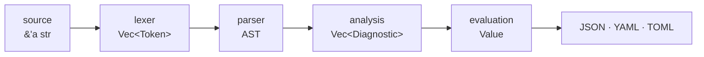

<div align="center">

# Aura

**A configuration language that reads its own inputs — and never lets an import do the same.**

Manifests compile to JSON, YAML or TOML, with schemas, enums, assertions that fail
the build instead of the deploy, and a capability model in which `env()` and
`read_file()` are granted per run — and the grant does not reach imported modules.

One binary, no runtime to install, 16 keywords, a 1.7 MB download.

[](https://github.com/aura-config/aura-lang/actions/workflows/ci.yml)
[](https://crates.io/crates/aura-lang)
[](https://docs.rs/aura-lang)


**[Try it in your browser](https://aura-config.github.io/aura-lang/playground/)** ·
[Documentation](https://aura-config.github.io/aura-lang/book/) ·
[Русская версия](README.ru.md)

</div>

> [!NOTE]
> Aura is a working preview (`0.1`). All six specification phases are implemented
> and the syntax has no open design questions, but nothing has run in production
> anywhere yet. While `0.x`, a minor release may still change the language — the
> [changelog](CHANGELOG.md) says so plainly.

---

## Install

<table>
<tr>
<td width="50%" valign="top">

**Nothing at all**

[Open the playground.](https://aura-config.github.io/aura-lang/playground/)
The real compiler, compiled to WebAssembly. Nothing is installed and nothing
leaves the page.

</td>
<td width="50%" valign="top">

**A binary**

```console
cargo install aura-lang
```

Or take a build from [Releases](https://github.com/aura-config/aura-lang/releases):
Linux (gnu and static musl), macOS (Intel and Apple silicon), Windows — each
with a `.sha256`.

</td>
</tr>
<tr>
<td valign="top">

**In CI**

```yaml
- uses: aura-config/setup-aura@v1
- run: aura check deploy.aura --strict
```

Resolves the version, verifies the checksum, puts `aura` on `PATH`.

</td>
<td valign="top">

**In a Rust program**

```toml
[dependencies]
aura-lang = { version = "0.1", default-features = false }
```

Without the default `cli` feature the library is 38 packages instead of 96,
and no C dependencies at all.

</td>
</tr>
</table>

> [!TIP]
> On x86_64 Linux prefer the **musl** build — it is what `setup-aura` installs.
> The gnu build requires `GLIBC_2.34` and will not start on Ubuntu 20.04,
> Debian 11, CentOS 8 or Amazon Linux 2. The static build has no such floor, and
> starts measurably faster.

## Sixty seconds

```ruby
# deploy.aura
base_port = 8000                                  # `=` computes, stays private
is_prod   = env("APP_ENV", "dev") == "production" # capability-gated

# `:` exports — everything under here ends up in the output
api:
  port:     base_port + 1
  replicas: cond
    is_prod -> 6
    else -> 1
  end
end

assert base_port > 1024, "ports below 1024 need root"
```

```console
$ aura eval deploy.aura --allow-env=APP_ENV
{
  "api": {
    "port": 8001,
    "replicas": 1
  }
}
```

Note what is *not* in the output: `base_port` and `is_prod`. That is the whole
rule — `:` exports, `=` does not.

## Why Aura

| Problem | Aura's answer |
| --- | --- |
| YAML breaks from one stray space | No significant indentation: structure comes from line breaks and an explicit `end` |
| Configs "work on my machine" | Deterministic by construction: without explicit flags a manifest has **no** access to files or environment variables |
| A module pulled from the internet reads `/etc/passwd` | Imported modules are isolated from I/O, and cannot borrow the caller's rights |
| "Why is prod on a different port?" | Values are immutable; shadowing requires the explicit `shadow` keyword |
| Dependency version drift in CI | Versioned imports and `aura.lock` with a token-stream integrity hash, plus `--frozen` |
| Dead config fragments live for years | Static analysis finds unused variables and imports; `--strict` makes them fail CI |
| A generated `config.json` nobody can trace | The manifest *is* the source, and `--dry-run` reports what it read and would write |

## The language

<details>
<summary><b>Computation and output are different things</b></summary>

<br>

Aura's central rule — the same idea as locals versus outputs in Terraform:

```ruby
tmp = base * 2 #  =  a private variable: does NOT end up in JSON
port: tmp + 1  #  :  a property: ends up in JSON
```

This is what makes dead-code analysis precise: an unused `=` variable is always
genuine cruft (`W0501`), never "maybe someone needs this output".

</details>

<details>
<summary><b>Immutability and explicit shadowing</b></summary>

<br>

```ruby
path = "/etc/global.config"

domain "prod"
  path        = "/var/log" # E0302: shadowing requires the keyword
  shadow path = "/var/log" # OK - the intent is explicit
end
```

Reassigning a name within the same scope is always an error (`E0301`).

</details>

<details>
<summary><b>Schemas, optional fields, closed sets</b></summary>

<br>

```ruby
enum Tier
  "frontend"
  "backend"
  "cache"
end

type Service
  name: String
  tier: Tier
  port: Int = 8080 # optional: omit it and the default applies
end

api: new Service
  name: "api"
  tier: "backand" # E0514: did you mean "backend"? members: ...
end
```

A missing field is `E0511`, a type mismatch `E0512`, an extra field `E0513` under
`--strict`. `Int` and `Float` are separate types, so byte limits and 64-bit IDs
never lose precision. An `enum` member stays an ordinary string — the JSON output
does not change, only what is accepted.

Optionality never introduces a `null`: a default is a value, not an absence.

</details>

<details>
<summary><b>Types for the service that consumes the config</b></summary>

<br>

The schema that validates the manifest can also type the program reading its
JSON, so there are no hand-written structs to keep in sync:

```console
aura types config.aura --lang rust   # or ts | go
```

```ts
export type Scheme = "https" | "http";

export interface Endpoint {
  host: string;
  port: number;
  scheme: Scheme;
}
```

Rust gets a `serde` struct plus an enum with `#[serde(rename)]`; Go gets a struct
with `json:` tags and typed constants. Parsing only — the manifest is never
evaluated, so no capabilities are involved, and the output is already canonical
for `rustfmt`, `gofmt` and `prettier`.

</details>

<details>
<summary><b>Functions, lambdas, methods</b></summary>

<br>

```ruby
def labels(app) # a def body is an object
  app: app
end

up = (s) -> s.upper() end # a lambda

xs.compact().uniq().map (item, index) ->
  "#{index}: #{item}"
end
```

Sixty methods across `String`, `Int`, `Float`, `Bool`, `List` and `Object` — the
full list is in [the method reference](docs/book/src/reference/methods.md).
`range(n)` produces `[0 … n-1]`, which is how you generate N shards or replicas
without listing them by hand.

</details>

<details>
<summary><b>Multi-way choice, and multi-line text</b></summary>

<br>

`cond` takes the first true arm, and the `else` is mandatory — no branch yields
nothing:

```ruby
tier = cond
  region == "eu" -> "frankfurt"
  region == "us" -> "virginia"
  else -> "singapore"
end
```

A `text … end` block is an ordinary multi-line string. Interpolation works;
braces inside do not, which is what makes generating nginx configs practical:

```ruby
entrypoint: text
  #!/bin/sh
  echo "starting #{app_name}"
  exec ./server --port #{port}
end
```

</details>

<details>
<summary><b>Deterministic time, and data access</b></summary>

<br>

`now()` does not exist and never will — an unreproducible config cannot be
written. Durations and dates are first-class:

```ruby
ttl = "1h30m".parse_duration()       # -> 5400 seconds
refresh: (ttl / 3).format_duration() # -> "30m"
```

If a build timestamp is needed the host supplies it as an input:
`env("BUILD_TIME", …)`.

Dot for fields, brackets only for list indices — one operator per operation:

```ruby
loaded = read_file("./data.json").parse_json()

version:  loaded.package.version          # ordinary keys
port:     loaded.servers."eu west".port   # a key with a space
first:    loaded.apps[0].name             # list index (out of bounds is E0317)
optional: loaded.get("maybe", "fallback") # safe access
```

A typo in a key is `E0308` with a position, not a silent `null`.

</details>

<details>
<summary><b>Modules and packages</b></summary>

<br>

```ruby
import github/actions/rust-cache@v1.2 as rust # a version is mandatory
import "templates/k8s_defaults.aura" as defaults
```

Cyclic imports are reported with the full chain. Every module is loaded, parsed
and evaluated exactly once. Exact versions and integrity hashes live in
`aura.lock`, and `--frozen` makes CI refuse anything else.

`aura add` is the **only** place Aura touches the network. `eval` always runs
offline, so a result never depends on what a registry served today.

</details>

<details>
<summary><b>Aura as a format converter</b></summary>

<br>

The language reads TOML, JSON and YAML and writes all three, so conversion is one
line:

```ruby
config: read_file("./legacy.toml").parse_toml()
```

```console
aura eval convert.aura --allow-read=. --format yaml
```

Unlike `yq` or `jq` you can validate against a schema, merge several sources and
add `assert` checks along the way — conversion with guarantees.

</details>

## Security model

By default a manifest **can do nothing**: no files, no environment variables.
Rights are granted per run, and they do not propagate.

| Flag | What it allows |
| --- | --- |
| `--allow-read=<dir>` | `read_file()` inside that directory (repeatable; paths are canonicalised, `..` cannot escape) |
| `--allow-env[=A,B]` | `env()` for the listed variables — with no list, all of them |
| `--allow-imports-io` | extends the root's rights to imported modules |
| `--hermetic` | the opposite: no I/O at all, `E0505` everywhere; excludes the `--allow-*` flags |

> [!IMPORTANT]
> Grants belong to the **root manifest**. A module you import cannot call `env()`
> or `read_file()` even when the root holds those rights, and an exported function
> runs with the capabilities of the module it came from — so isolation cannot be
> borrowed by persuading you to call something innocent-looking.

A call without a grant is `E0310`; a grant that does not cover the path is
`E0311`. An effectful call inside an imported module is caught statically as
`W0512`, before anything runs.

`--hermetic` inverts the question. Rather than granting rights it requires that
none are needed — and because `E0505` is an *analysis* error, this is settled
without evaluating anything, including for branches a given run would not take:

```console
$ aura check --hermetic deploy.aura
[E0505] Error: env() is not allowed in hermetic mode
```

## Command line

```text
aura eval <file.aura>  [--strict] [--dry-run] [--frozen] [--hermetic]
                       [--allow-read=<dir>] [--allow-env[=A,B]] [--allow-imports-io]
                       [--format json|json-flat|yaml|toml] [-o out.json] [--registry-dir=<dir>]
aura check <file.aura> [--strict] [--hermetic]
aura fmt <files...>    [--check]
aura types <file.aura> --lang rust|ts|go [--out <file>]
aura docs --agent      [-o <file>]
aura add <path>@vX.Y.Z [--from <file>] [--registry-dir=<dir>]
```

| Mode | Behaviour |
| --- | --- |
| `--strict` | analysis warnings become errors; extra schema fields are forbidden |
| `--dry-run` | a full evaluation, but nothing is written — you get a report of what it read and would write |
| `--frozen` | dependencies resolve strictly via `aura.lock`; a mismatch is an error and the lock is never rewritten |
| `--hermetic` | settles, statically, that the manifest performs no I/O |

Exit codes: `0` success, `1` diagnostics, `2` an I/O or argument error.

### Working with an AI assistant

`aura docs --agent` prints the complete language reference — syntax, standard
library, every diagnostic code — assembled from the compiler's own definitions,
at roughly four thousand tokens. Small enough to hand over whole, and it always
describes the binary that produced it. One line in your repository's `AGENTS.md`
is enough:

```text
Before writing or editing .aura files, run `aura docs --agent` for the complete
language reference.
```

The same text is published at
[/llms.txt](https://aura-config.github.io/aura-lang/llms.txt).

## Using Aura from other languages

The CLI contract *is* the API, in the tradition of `terraform`, `jq` and
`pandoc`: JSON on stdout, stable `E0xxx` codes on stderr, exit codes `0`/`1`/`2`.

<details>
<summary><b>Python, Node, Go — the subprocess pattern</b></summary>

<br>

```python
import json, subprocess
r = subprocess.run(["aura", "eval", "app.aura", "--frozen"], capture_output=True, text=True)
if r.returncode != 0:
    raise RuntimeError(r.stderr)
config = json.loads(r.stdout)
```

```javascript
const { execFileSync } = require("node:child_process");
const config = JSON.parse(execFileSync("aura", ["eval", "app.aura", "--frozen"]));
```

```go
out, err := exec.Command("aura", "eval", "app.aura", "--frozen").Output()
if err != nil { log.Fatal(err) }
var config map[string]any
json.Unmarshal(out, &config)
```

For production: `--frozen` with a committed lock file, capabilities only
explicit, and `--format yaml|toml` if the consumer prefers another shape.

</details>

<details>
<summary><b>Rust — embed the library, no subprocess</b></summary>

<br>

```rust
use aura_lang::facade::{eval_file, EvalOptions};

let opts = EvalOptions { strict: true, ..Default::default() };
let out = eval_file("config/app.aura".as_ref(), &opts)?;
let cfg: MyConfig = serde_json::from_value(out.json)?;
```

There is no intermediate file: the application reads the manifest itself.

A manifest's `pub def` is also a callable value, so rules can live in a `.aura`
file and be executed by the application per request, changing behaviour without a
rebuild. That is a **sketch, not a supported API** — see
`cargo run --example scripting` and D19 in [SPEC.md](SPEC.md).

</details>

Mobile applications consume the *result*: a server or CI evaluates the manifest,
the client reads the JSON. A WebAssembly build exists and is CI-tested — it is
what the playground runs on — and npm, PyO3 and a C ABI are on demand.

## Diagnostics

Errors carry a file, line and column, highlight the code, and suggest a fix:

```text
[E0302] Error: 'global_file_path' shadows an outer variable
    ╭─[ production_deploy.aura:24:3 ]
 24 │   global_file_path = "/var/log/aura.log"
    │   ─────────┬────────
    │            ╰── add `shadow`
    │
    │   Help: write `shadow global_file_path = ...` to make the shadowing explicit
────╯
```

Every code is stable and documented in
[the catalogue](docs/book/src/reference/error-codes.md) — a test keeps that list
and the compiler in step, in both directions.

## Architecture



Tokens and the AST borrow the source's memory — nothing is copied along the way.

```text
crates/
├── aura-lang        # the library and the `aura` CLI, one publishable crate
│   ├── lexer/       # zero-copy DFA, newline normalisation
│   ├── parser/      # recursive descent + Pratt expressions
│   ├── analysis/    # dead code, undefined names, shadow rules
│   ├── eval/        # tree-walking interpreter, environments, method registry
│   ├── vfs/         # resolvers, cycle detection, aura.lock
│   └── serialize/   # Value -> JSON/YAML/TOML, Int without precision loss
└── aura-lsp         # the language server, built on aura-lang
```

**Invariants.** *Zero-copy*: neither lexer nor parser copies a string.
*Determinism*: JSON key order is declaration order, and two runs are
byte-identical. *Immutability*: containers live in `Arc`, so cloning a value is
O(1).

## Performance

`cargo bench -p aura-lang`, on the reference manifest:

| Stage | Result |
| --- | --- |
| Lexer | 258 MiB/s |
| Lexer + parser | 178 MiB/s |
| Lexer + parser + resolver | 71 MiB/s |
| Full pipeline (lex + parse + evaluate) | **33 µs** per manifest |

Measured 2026-07-29 on x86_64 Linux. Numbers from one machine are worth what they
cost — treat them as an order of magnitude, and re-run them on yours.

## How this is verified

<details>
<summary><b>What runs on every change</b></summary>

<br>

| | |
| --- | --- |
| Tests | 241, on Linux, macOS and Windows |
| Conformance | every example in [examples/](examples/README.md) driven through the **real binary**, output diffed against a pinned expectation |
| End to end | [packaging/e2e.sh](packaging/e2e.sh) asserts 26 documented claims — exit codes, capability refusals, hermetic mode, output formats, and byte-identical output across two runs |
| Containers | on a tag, those artefacts run on debian:12, ubuntu:22.04, alpine, ubuntu:20.04, and aarch64 under emulation |
| Miri | the source arena, under **both** Stacked Borrows and Tree Borrows |
| Fuzzing | six `cargo-fuzz` targets: lexer, parser, pipeline, formatter, codegen, resolver |
| Cross-platform | `cargo check` for freebsd, aarch64-linux, musl and wasm32 |
| Documentation | snippets must be canonical `aura fmt`; the diagnostic catalogue must match the compiler exactly, in both languages |

The recursive-descent parser is DoS-hardened: deeply nested input yields `E0208`
rather than a stack overflow, and that is checked in release builds, where there
is no thread with a large stack to hide behind.

</details>

```console
cargo test --workspace     # units, conformance, property tests, snapshots
cargo bench -p aura-lang   # lexer, parser, resolver, full pipeline
```

The formal specification, including the numbered design decisions the code refers
to by name, is [SPEC.md](SPEC.md).

## Status

All six specification phases are implemented, and the syntax has no open design
questions.

<details>
<summary><b>What is done, and what is not</b></summary>

<br>

**The language and its tooling**

- [x] Zero-copy lexer and Pratt parser
- [x] Runtime with a capability model, schemas and `enum`
- [x] Modules, cycle detection, `aura.lock` with a token-stream hash
- [x] Static analysis, `--strict`, `--dry-run`, `--hermetic`
- [x] JSON, flattened JSON, YAML and TOML output
- [x] `aura fmt` — canonical formatting with a token-stream guarantee
- [x] `aura types` — Rust, TypeScript and Go from a manifest's schemas
- [x] `aura docs --agent` — the whole language for a coding assistant
- [x] Deterministic time; `now()` forbidden by construction
- [x] Language server: completion, hover, go-to-definition, references, symbols,
      rename, signature help, format-on-save

**Ecosystem and distribution**

- [x] Published to crates.io, with binaries for six targets on every tag
- [x] [`aura-config/setup-aura@v1`](https://github.com/aura-config/setup-aura)
      for GitHub Actions
- [x] A [browser playground](https://aura-config.github.io/aura-lang/playground/)
      running the real compiler as WebAssembly
- [x] A [documentation book](https://aura-config.github.io/aura-lang/book/), with
      a [full Russian translation](https://aura-config.github.io/aura-lang/book/ru/)
- [x] Syntax highlighting for VS Code, Vim/Neovim and nano — [editors/](editors/README.md)
- [ ] A tree-sitter grammar (Helix, Zed, GitHub Linguist)
- [ ] npm, PyO3 and a C ABI — on demand rather than ahead of it

**Towards 1.0.** Two criteria remain, and neither of them is code: a promise of
backward compatibility, and real users whose configs must not break.

</details>

## Contributing

Issues and pull requests are welcome. Before opening one:

```console
cargo test --workspace
cargo clippy --workspace --all-targets -- -D warnings
cargo fmt --all --check
```

CI runs exactly those, plus `aura fmt --check` on any changed `.aura` file. Code
comments and commit messages are in English. [AGENTS.md](AGENTS.md) records where
each fact has its single home — worth reading before adding a second copy of one.

## License

MIT ([LICENSE-MIT](LICENSE-MIT)) or Apache 2.0 ([LICENSE-APACHE](LICENSE-APACHE)),
at your option.

Unless you state otherwise, any contribution you intentionally submit for
inclusion shall be licensed as above, with no additional terms.
