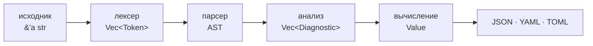

<div align="center">

# Aura

**Конфигурационный язык, который читает свои входные данные — и не даёт делать то же самое ничему, что импортирует.**

Манифесты компилируются в JSON, YAML или TOML — со схемами, enum, проверками
`assert`, которые роняют сборку, а не деплой, и capability-моделью, в которой
`env()` и `read_file()` выдаются на запуск, а выданное право не наследуется
импортированными модулями.

Один бинарник, никакого рантайма, 16 ключевых слов, 1.7 МБ на скачивание.

[](https://github.com/aura-config/aura-lang/actions/workflows/ci.yml)
[](https://crates.io/crates/aura-lang)
[](https://docs.rs/aura-lang)


**[Попробовать в браузере](https://aura-config.github.io/aura-lang/playground/)** ·
[Документация](https://aura-config.github.io/aura-lang/book/ru/) ·
[English version](README.md)

</div>

> [!NOTE]
> Aura — рабочее превью (`0.1`). Все шесть фаз спецификации реализованы, открытых
> вопросов по синтаксису нет, но нигде в продакшене язык ещё не работал. Пока
> версия `0.x`, минорный выпуск имеет право поменять язык — об этом прямо сказано
> в [журнале изменений](CHANGELOG.md).

---

## Установка

<table>
<tr>
<td width="50%" valign="top">

**Ничего не устанавливая**

[Открыть playground.](https://aura-config.github.io/aura-lang/playground/)
Настоящий компилятор, собранный в WebAssembly. Ничего не ставится и ничего не
покидает страницу.

</td>
<td width="50%" valign="top">

**Бинарник**

```console
cargo install aura-lang
```

Либо готовая сборка со страницы
[Releases](https://github.com/aura-config/aura-lang/releases): Linux (gnu и
статический musl), macOS (Intel и Apple silicon), Windows — к каждой `.sha256`.

</td>
</tr>
<tr>
<td valign="top">

**В CI**

```yaml
- uses: aura-config/setup-aura@v1
- run: aura check deploy.aura --strict
```

Определяет версию, сверяет контрольную сумму, кладёт `aura` в `PATH`.

</td>
<td valign="top">

**В программе на Rust**

```toml
[dependencies]
aura-lang = { version = "0.1", default-features = false }
```

Без фичи `cli` библиотека тянет 38 пакетов вместо 96 и ни одной C-зависимости.

</td>
</tr>
</table>

> [!TIP]
> На x86_64 Linux берите **musl**-сборку — именно её ставит `setup-aura`.
> Gnu-сборке нужен `GLIBC_2.34`, и она не стартует на Ubuntu 20.04, Debian 11,
> CentOS 8 и Amazon Linux 2. У статической порога нет вовсе, и стартует она
> измеримо быстрее.

## Шестьдесят секунд

```ruby
# deploy.aura
base_port = 8000                                  # `=` вычисляет, остаётся приватным
is_prod   = env("APP_ENV", "dev") == "production" # право выдаётся флагом

# `:` экспортирует — всё, что ниже, попадёт в вывод
api:
  port:     base_port + 1
  replicas: cond
    is_prod -> 6
    else -> 1
  end
end

assert base_port > 1024, "порты ниже 1024 требуют root"
```

```console
$ aura eval deploy.aura --allow-env=APP_ENV
{
  "api": {
    "port": 8001,
    "replicas": 1
  }
}
```

Обратите внимание, чего в выводе **нет**: `base_port` и `is_prod`. В этом всё
правило — `:` экспортирует, `=` нет.

## Почему Aura

| Проблема | Решение Aura |
| --- | --- |
| YAML ломается от одного лишнего пробела | Нет значимых отступов: структура задаётся переносами строк и явным `end` |
| Конфиги «зависят от машины» | Детерминизм по построению: без явных флагов у манифеста **нет** доступа к файлам и переменным окружения |
| Скопированный из интернета модуль читает `/etc/passwd` | Импортированные модули изолированы от I/O и не могут занять права вызывающего |
| «Почему в проде другой порт?» | Значения иммутабельны; затенение — только явное `shadow` |
| Дрейф версий зависимостей в CI | Версионируемые импорты и `aura.lock` с хешем потока токенов, плюс `--frozen` |
| Мёртвые куски конфига живут годами | Статический анализ находит неиспользуемые переменные и импорты; `--strict` роняет на них CI |
| Сгенерированный `config.json`, происхождение которого не проследить | Манифест **и есть** источник, а `--dry-run` докладывает, что он прочитал и что записал бы |

## Язык

<details>
<summary><b>Вычисление и вывод — разные вещи</b></summary>

<br>

Центральное правило Aura — та же идея, что locals против outputs в Terraform:

```ruby
tmp = base * 2 #  =  приватная переменная: в JSON НЕ попадает
port: tmp + 1  #  :  свойство: попадает в JSON
```

Именно это делает анализ мёртвого кода точным: неиспользованная `=`-переменная
всегда настоящий мусор (`W0501`), а не «вдруг кому-то нужен этот вывод».

</details>

<details>
<summary><b>Иммутабельность и явное затенение</b></summary>

<br>

```ruby
path = "/etc/global.config"

domain "prod"
  path        = "/var/log" # E0302: затенение требует ключевого слова
  shadow path = "/var/log" # OK — намерение явное
end
```

Переприсваивание имени в той же области видимости — всегда ошибка (`E0301`).

</details>

<details>
<summary><b>Схемы, необязательные поля, закрытые множества</b></summary>

<br>

```ruby
enum Tier
  "frontend"
  "backend"
  "cache"
end

type Service
  name: String
  tier: Tier
  port: Int = 8080 # необязательное: опустите — применится значение по умолчанию
end

api: new Service
  name: "api"
  tier: "backand" # E0514: возможно, "backend"? члены: ...
end
```

Пропущенное поле — `E0511`, несовпадение типа — `E0512`, лишнее поле под
`--strict` — `E0513`. `Int` и `Float` — разные типы, поэтому лимиты в байтах и
64-битные идентификаторы не теряют точность. Член `enum` остаётся обычной
строкой — JSON на выходе не меняется, меняется только то, что принимается.

Необязательность никогда не вводит `null`: значение по умолчанию — это значение,
а не отсутствие.

</details>

<details>
<summary><b>Типы для сервиса, который читает конфиг</b></summary>

<br>

Схема, проверяющая манифест, может заодно типизировать программу, читающую его
JSON, — руками писать структуры и держать их в согласии не нужно:

```console
aura types config.aura --lang rust   # или ts | go
```

```ts
export type Scheme = "https" | "http";

export interface Endpoint {
  host: string;
  port: number;
  scheme: Scheme;
}
```

Rust получает `serde`-структуру и enum с `#[serde(rename)]`, Go — структуру с
тегами `json:` и типизированные константы. Только разбор: манифест не вычисляется,
поэтому права ни при чём, а вывод сразу канонический для `rustfmt`, `gofmt` и
`prettier`.

</details>

<details>
<summary><b>Функции, лямбды, методы</b></summary>

<br>

```ruby
def labels(app) # тело def — это объект
  app: app
end

up = (s) -> s.upper() end # лямбда

xs.compact().uniq().map (item, index) ->
  "#{index}: #{item}"
end
```

Шестьдесят методов у `String`, `Int`, `Float`, `Bool`, `List` и `Object` —
полный список в [справочнике методов](docs/book-ru/src/reference/methods.md).
`range(n)` даёт `[0 … n-1]` — так порождают N шардов или реплик, не перечисляя их
руками.

</details>

<details>
<summary><b>Множественный выбор и многострочный текст</b></summary>

<br>

`cond` берёт первую истинную ветку, а `else` обязателен — ни одна ветвь не
остаётся без значения:

```ruby
tier = cond
  region == "eu" -> "frankfurt"
  region == "us" -> "virginia"
  else -> "singapore"
end
```

Блок `text … end` — обычная многострочная строка. Интерполяция работает, фигурные
скобки внутри — нет, и именно поэтому на Aura практично генерировать конфиги
nginx:

```ruby
entrypoint: text
  #!/bin/sh
  echo "starting #{app_name}"
  exec ./server --port #{port}
end
```

</details>

<details>
<summary><b>Детерминированное время и доступ к данным</b></summary>

<br>

`now()` не существует и не появится — невоспроизводимый конфиг нельзя написать.
Длительности и даты при этом полноценны:

```ruby
ttl = "1h30m".parse_duration()       # -> 5400 секунд
refresh: (ttl / 3).format_duration() # -> "30m"
```

Если нужна отметка времени сборки, её передаёт хост, как вход:
`env("BUILD_TIME", …)`.

Точка — для полей, скобки — только для индексов списка, по одной операции на
оператор:

```ruby
loaded = read_file("./data.json").parse_json()

version:  loaded.package.version          # обычные ключи
port:     loaded.servers."eu west".port   # ключ с пробелом
first:    loaded.apps[0].name             # индекс списка (выход за границы — E0317)
optional: loaded.get("maybe", "fallback") # безопасный доступ
```

Опечатка в ключе — это `E0308` с позицией, а не молчаливый `null`.

</details>

<details>
<summary><b>Модули и пакеты</b></summary>

<br>

```ruby
import github/actions/rust-cache@v1.2 as rust # версия обязательна
import "templates/k8s_defaults.aura" as defaults
```

Циклические импорты сообщаются вместе с полной цепочкой. Каждый модуль
загружается, разбирается и вычисляется ровно один раз. Точные версии и хеши
целостности живут в `aura.lock`, а `--frozen` заставляет CI не принимать ничего
другого.

`aura add` — **единственное** место, где Aura ходит в сеть. `eval` всегда
работает офлайн, поэтому результат не зависит от того, что реестр отдал сегодня.

</details>

<details>
<summary><b>Aura как конвертер форматов</b></summary>

<br>

Язык читает TOML, JSON и YAML и пишет все три, поэтому конвертация — одна строка:

```ruby
config: read_file("./legacy.toml").parse_toml()
```

```console
aura eval convert.aura --allow-read=. --format yaml
```

В отличие от `yq` и `jq`, по дороге можно проверить схемой, слить несколько
источников и добавить `assert` — конвертация с гарантиями.

</details>

## Модель безопасности

По умолчанию манифест **не может ничего**: ни файлов, ни переменных окружения.
Права выдаются на запуск и не наследуются.

| Флаг | Что разрешает |
| --- | --- |
| `--allow-read=<dir>` | `read_file()` внутри каталога (можно повторять; пути канонизируются, `..` не выводит наружу) |
| `--allow-env[=A,B]` | `env()` для перечисленных переменных — без списка все |
| `--allow-imports-io` | распространяет права корня на импортированные модули |
| `--hermetic` | наоборот: никакого I/O, `E0505` везде; несовместим с флагами `--allow-*` |

> [!IMPORTANT]
> Права принадлежат **корневому манифесту**. Импортированный модуль не может
> вызвать `env()` или `read_file()`, даже когда право есть у корня, а
> экспортированная функция выполняется с правами того модуля, откуда она
> пришла, — то есть изоляцию нельзя занять, уговорив вас вызвать что-то
> безобидное на вид.

Вызов без права — `E0310`; право, не покрывающее путь, — `E0311`. Эффектный вызов
внутри импортированного модуля дополнительно виден статически как `W0512`, ещё до
запуска.

`--hermetic` переворачивает вопрос: вместо выдачи прав он требует, чтобы прав не
требовалось. И поскольку `E0505` — ошибка **анализа**, это решается без
вычисления, включая ветки, которые данный запуск не выполнил бы:

```console
$ aura check --hermetic deploy.aura
[E0505] Error: env() is not allowed in hermetic mode
```

## Командная строка

```text
aura eval <file.aura>  [--strict] [--dry-run] [--frozen] [--hermetic]
                       [--allow-read=<dir>] [--allow-env[=A,B]] [--allow-imports-io]
                       [--format json|json-flat|yaml|toml] [-o out.json] [--registry-dir=<dir>]
aura check <file.aura> [--strict] [--hermetic]
aura fmt <files...>    [--check]
aura types <file.aura> --lang rust|ts|go [--out <file>]
aura docs --agent      [-o <file>]
aura add <path>@vX.Y.Z [--from <file>] [--registry-dir=<dir>]
```

| Режим | Поведение |
| --- | --- |
| `--strict` | предупреждения анализа становятся ошибками; лишние поля схемы запрещены |
| `--dry-run` | полное вычисление, но ничего не пишется — выдаётся отчёт, что прочитано и что было бы записано |
| `--frozen` | зависимости резолвятся строго по `aura.lock`; расхождение — ошибка, лок не переписывается |
| `--hermetic` | статически устанавливает, что манифест не выполняет никакого I/O |

Коды возврата: `0` — успех, `1` — диагностика, `2` — ошибка ввода-вывода или аргументов.

### Работа с ИИ-ассистентом

`aura docs --agent` печатает полный справочник по языку — синтаксис, стандартную
библиотеку, все коды диагностик, — собранный из определений самого компилятора,
объёмом около четырёх тысяч токенов. Достаточно мало, чтобы отдать целиком, и он
всегда описывает тот бинарник, который его произвёл. Хватает одной строки в
`AGENTS.md` вашего проекта:

```text
Before writing or editing .aura files, run `aura docs --agent` for the complete
language reference.
```

Тот же текст опубликован по адресу
[/llms.txt](https://aura-config.github.io/aura-lang/llms.txt).

## Использование из других языков

Контракт CLI **и есть** API, в традиции `terraform`, `jq` и `pandoc`: JSON в
stdout, стабильные коды `E0xxx` в stderr, коды возврата `0`/`1`/`2`.

<details>
<summary><b>Python, Node, Go — паттерн subprocess</b></summary>

<br>

```python
import json, subprocess
r = subprocess.run(["aura", "eval", "app.aura", "--frozen"], capture_output=True, text=True)
if r.returncode != 0:
    raise RuntimeError(r.stderr)
config = json.loads(r.stdout)
```

```javascript
const { execFileSync } = require("node:child_process");
const config = JSON.parse(execFileSync("aura", ["eval", "app.aura", "--frozen"]));
```

```go
out, err := exec.Command("aura", "eval", "app.aura", "--frozen").Output()
if err != nil { log.Fatal(err) }
var config map[string]any
json.Unmarshal(out, &config)
```

Для продакшена: `--frozen` с закоммиченным локом, права только явные и
`--format yaml|toml`, если потребитель предпочитает другую форму.

</details>

<details>
<summary><b>Rust — встраивание библиотеки, без subprocess</b></summary>

<br>

```rust
use aura_lang::facade::{eval_file, EvalOptions};

let opts = EvalOptions { strict: true, ..Default::default() };
let out = eval_file("config/app.aura".as_ref(), &opts)?;
let cfg: MyConfig = serde_json::from_value(out.json)?;
```

Промежуточного файла нет: приложение само читает манифест.

`pub def` манифеста — тоже вызываемое значение, поэтому правила могут жить в
`.aura`-файле, а приложение вызывать их на каждый запрос, меняя поведение без
пересборки. Это **набросок, а не поддерживаемый API** — см.
`cargo run --example scripting` и D19 в [SPEC.md](SPEC.md).

</details>

Мобильные приложения потребляют **результат**: сервер или CI вычисляет манифест,
клиент читает JSON. WebAssembly-сборка существует и проверяется в CI — на ней
работает playground, — а npm, PyO3 и C ABI будут по спросу.

## Диагностика

Ошибки несут файл, строку и колонку, подсвечивают код и подсказывают исправление:

```text
[E0302] Error: 'global_file_path' shadows an outer variable
    ╭─[ production_deploy.aura:24:3 ]
 24 │   global_file_path = "/var/log/aura.log"
    │   ─────────┬────────
    │            ╰── add `shadow`
    │
    │   Help: write `shadow global_file_path = ...` to make the shadowing explicit
────╯
```

Каждый код стабилен и описан в
[каталоге](docs/book-ru/src/reference/error-codes.md) — тест держит этот список и
компилятор в согласии, причём в обе стороны.

## Архитектура



Токены и AST заимствуют память исходника — по дороге ничего не копируется.

```text
crates/
├── aura-lang        # библиотека и CLI `aura`, один публикуемый крейт
│   ├── lexer/       # zero-copy DFA, нормализация переносов
│   ├── parser/      # рекурсивный спуск + Pratt для выражений
│   ├── analysis/    # мёртвый код, неопределённые имена, правила shadow
│   ├── eval/        # древесный интерпретатор, окружения, реестр методов
│   ├── vfs/         # резолверы, детект циклов, aura.lock
│   └── serialize/   # Value -> JSON/YAML/TOML, Int без потери точности
└── aura-lsp         # языковой сервер поверх aura-lang
```

**Инварианты.** *Zero-copy*: ни лексер, ни парсер не копируют строк.
*Детерминизм*: порядок ключей в JSON — порядок объявления, два запуска дают
побайтово одинаковый результат. *Иммутабельность*: контейнеры живут в `Arc`,
клонирование значения — O(1).

## Производительность

`cargo bench -p aura-lang`, на эталонном манифесте:

| Этап | Результат |
| --- | --- |
| Лексер | 258 МиБ/с |
| Лексер + парсер | 178 МиБ/с |
| Лексер + парсер + резолвер | 71 МиБ/с |
| Полный конвейер (lex + parse + eval) | **33 мкс** на манифест |

Замерено 2026-07-29 на x86_64 Linux. Числа с одной машины стоят ровно столько,
сколько стоят, — считайте их порядком величины и прогоняйте у себя.

## Как это проверяется

<details>
<summary><b>Что прогоняется на каждое изменение</b></summary>

<br>

| | |
| --- | --- |
| Тесты | 241, на Linux, macOS и Windows |
| Conformance | каждый пример из [examples/](examples/README.md) прогоняется через **настоящий бинарник**, вывод сверяется с закреплённым ожиданием |
| Сквозные | [packaging/e2e.sh](packaging/e2e.sh) проверяет 26 задокументированных утверждений — коды возврата, отказы по правам, герметичный режим, форматы вывода и побайтовое совпадение двух прогонов |
| Контейнеры | на теге те же артефакты запускаются на debian:12, ubuntu:22.04, alpine, ubuntu:20.04 и aarch64 под эмуляцией |
| Miri | арена исходников, под **обеими** моделями — Stacked Borrows и Tree Borrows |
| Фаззинг | шесть таргетов `cargo-fuzz`: лексер, парсер, конвейер, форматтер, codegen, резолвер |
| Кросс-платформенность | `cargo check` для freebsd, aarch64-linux, musl и wasm32 |
| Документация | сниппеты обязаны быть каноническим `aura fmt`; каталог диагностик обязан совпадать с компилятором, на обоих языках |

Парсер рекурсивного спуска устойчив к DoS: глубоко вложенный ввод даёт `E0208`, а
не переполнение стека, и это проверяется в релизных сборках, где нет потока с
большим стеком, за которым можно спрятаться.

</details>

```console
cargo test --workspace     # юниты, conformance, property-тесты, снапшоты
cargo bench -p aura-lang   # лексер, парсер, резолвер, полный конвейер
```

Формальная спецификация, включая нумерованные дизайн-решения, на которые код
ссылается по имени, — [SPEC.ru.md](SPEC.ru.md).

## Статус

Все шесть фаз спецификации реализованы, открытых вопросов по синтаксису нет.

<details>
<summary><b>Что сделано, а что нет</b></summary>

<br>

**Язык и инструменты**

- [x] Zero-copy лексер и Pratt-парсер
- [x] Рантайм с capability-моделью, схемами и `enum`
- [x] Модули, детект циклов, `aura.lock` с хешем потока токенов
- [x] Статический анализ, `--strict`, `--dry-run`, `--hermetic`
- [x] Вывод в JSON, плоский JSON, YAML и TOML
- [x] `aura fmt` — каноническое форматирование с гарантией неизменности потока токенов
- [x] `aura types` — Rust, TypeScript и Go из схем манифеста
- [x] `aura docs --agent` — весь язык для ИИ-ассистента
- [x] Детерминированное время; `now()` запрещён по построению
- [x] Языковой сервер: автодополнение, hover, переход к определению, поиск ссылок,
      символы, переименование, подсказка сигнатуры, форматирование при сохранении

**Экосистема и дистрибуция**

- [x] Опубликовано на crates.io, бинарники под шесть целей на каждый тег
- [x] [`aura-config/setup-aura@v1`](https://github.com/aura-config/setup-aura)
      для GitHub Actions
- [x] [Playground в браузере](https://aura-config.github.io/aura-lang/playground/)
      на настоящем компиляторе, собранном в WebAssembly
- [x] [Книга документации](https://aura-config.github.io/aura-lang/book/ru/), с
      [полной английской версией](https://aura-config.github.io/aura-lang/book/)
- [x] Подсветка синтаксиса для VS Code, Vim/Neovim и nano — [editors/](editors/README.md)
- [ ] tree-sitter-грамматика (Helix, Zed, GitHub Linguist)
- [ ] npm, PyO3 и C ABI — по спросу, а не заранее

**К 1.0.** Осталось два критерия, и ни один не про код: обещание обратной
совместимости и реальные пользователи, чьи конфиги нельзя ломать.

</details>

## Участие в разработке

Issue и pull request приветствуются. Перед тем как открыть:

```console
cargo test --workspace
cargo clippy --workspace --all-targets -- -D warnings
cargo fmt --all --check
```

CI прогоняет ровно это плюс `aura fmt --check` на изменённых `.aura`-файлах.
Комментарии в коде и сообщения коммитов — на английском. В [AGENTS.md](AGENTS.md)
записано, где у каждого факта единственный дом, — стоит прочитать, прежде чем
заводить вторую копию.

## Лицензия

MIT ([LICENSE-MIT](LICENSE-MIT)) либо Apache 2.0 ([LICENSE-APACHE](LICENSE-APACHE)),
на ваш выбор.

Если вы явно не оговорили иное, любой ваш вклад, намеренно отправленный для
включения в проект, лицензируется так же, без дополнительных условий.
